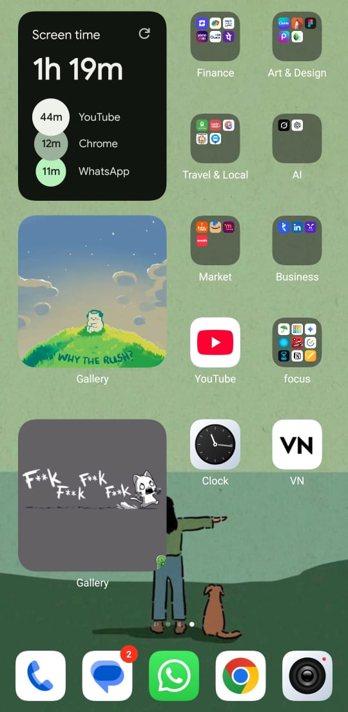

<h1 align="center">Hi 👋, I'm Harisudhan</h1>
<h3 align="center">MERN Stack Developer | Competitive Programmer | Tech Explorer</h3>

  

---

### 🧩 My Productivity Setup

<table align="center">
  <tr>
    <td align="center">
      <!-- Previous GIFs -->
       
       
       
       
       
       
       
    </td>
    <td align="center">
      
    </td>
  </tr>
</table>

---

### 🛠️ Tech Stack

  
  
  
  
  
  
  
  
  
  
  
  

---

### 📊 GitHub Stats

  
   
  

---

### 🧠 LeetCode Stats

  

---

### 🌐 Connect with Me

  
  

